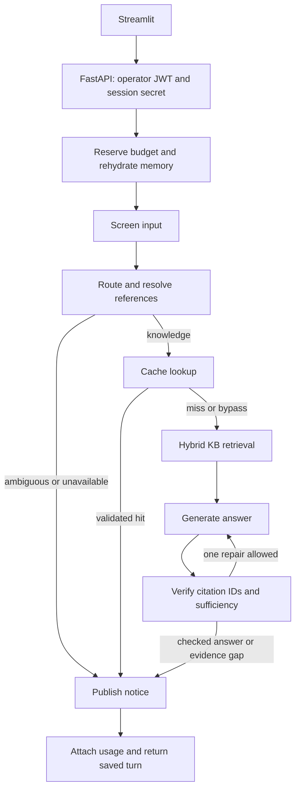

# Admin Chatbot: PR #213 Implementation and Continuation Guide

This is the current handoff for [PR #213](https://github.com/MoHatemTC/barq-sprints-agentic-incident-resolution-platform-g1/pull/213),
branch `feat/admin-chatbot`. It covers the complete PR, including the original chatbot
implementation and subsequent memory, UI, budget and cache repairs. Another developer
or coding agent should read this document before extending the chatbot.

The implementation worktree was `/tmp/barq-admin-chatbot`; that temporary path is not
required after checkout. The PR started from `main` at `e065df9`.

## 1. What the PR delivers

The product is an internal ServiceNow knowledge assistant for trusted operators.
It answers across the permitted KB, including process/manual articles, and shows
article identity, manual section and supporting excerpts. It retains conversation
history, resolves follow-ups, and can reuse eligible KB answers through Redis caching.

| Milestone | Implemented in this PR | Acceptance status |
|---|---|---|
| M1: KB chat | API, Streamlit, persistence, privacy screening, retrieval, citations, request recovery | Default tests pass; browser/local-service E2E pending |
| M2: memory | Follow-up rewriting, topic guard, clarification, bounded history and persisted summaries | Default tests pass; model-driven behavior needs E2E |
| M3: answer cache | Exact/semantic lookup, source validation, partitions, revision invalidation, cost diagnostics | Mocked tests pass; real Redis/proxy behavior needs E2E |
| M4: incident reads | Explicit unavailable response only | Next implementation milestone |
| M5: confirmed notes | Explicit unavailable response only | Planned after M4 |
| M6: final delivery | Runbooks and verification records started | Integration, demo and final acceptance pending |

Incident creation, reassignment, resolution/closure, KB publishing through chat,
attachments and individual SSO are outside the current release plan.

## 2. Read these files in order

1. [Operational guide](admin_chatbot.md): startup, configuration, cache operation.
2. [Manual E2E suite](admin_chatbot_e2e_test_suite.md): reproducible cases and bug template.
3. [M2 verification](chat_m2_verification.md) and [M3 verification](chat_m3_verification.md):
   actual results, what was mocked, and acceptance gaps.
4. [Chat service](../src/app/chat/service.py) and [graph](../src/app/chat/graph.py): lifecycle.
5. [Nodes](../src/app/chat/nodes.py), [prompts](../src/app/chat/prompts.py),
   [store](../src/app/chat/store.py), [cache](../src/app/chat/cache.py).
6. [API router](../src/api/routers/chat.py), [UI](../src/app/chat_ui/app.py),
   [tests](../tests/chat/).

Older local GLM briefs and review notes are historical snapshots. This guide and
the committed code define the current implementation; do not assume every defect
listed in an older review is still present.

## 3. Architecture and reuse

The UI calls the existing FastAPI backend. Canonical chat logic lives under
`src/app/chat/`; this is a separate LangGraph workflow from incident automation.
PostgreSQL stores chat state, Redis handles budgets/cache, and Qdrant provides KB
retrieval. Model calls reuse the existing LiteLLM facade through a chat-specific gateway.



History-summary preparation currently occurs before the graph input-screening node.
The summary call uses previously sanitized stored history. A screening refusal prevents
routing/answer generation, but a turn with older history may already have incurred
summary cost. Tests must distinguish these stages when asserting call counts.

The shared collection remains `incident_knowledge_base`. The incident retriever keeps
its `category=process` exclusion. Chat uses low-level hybrid retrieval without incident
category/service restrictions, while retaining lifecycle and security filters.

| Module | Responsibility |
|---|---|
| `chat/config.py` | Feature toggles, visibility, memory/cache/budget bounds |
| `chat/dependencies.py` | App-specific service wiring and shared clients |
| `chat/service.py` | Budget admission, history/summary preparation, graph execution, usage |
| `chat/prompts.py` / `state.py` | Structured route/answer/summary contracts and graph state |
| `chat/screening.py` | Raw pattern checks, regex redaction, residual PII and injection checks |
| `chat/retrieval.py` / `citations.py` | Full permitted KB search and source validation/display |
| `chat/store.py` | Ordered sanitized messages, atomic publication, summary cursor |
| `chat/cache.py` | Bounded exact/semantic Redis answer cache |
| `retrieval/corpus_revision.py` | Cache-enabled ingestion locking and revision changes |
| `chat_ui/app.py` / `state.py` | UI, per-conversation pending requests and pagination |

`src/agent/llm.py` gained optional completion limits and a usage callback; existing
incident callers keep their original defaults. Preserve this backward compatibility.

## 4. API, authentication and persistence

All chat routes use `/api/v1/chat`, operator JWT authentication and the `operator`
role. `POST /sessions` returns a random session secret once; PostgreSQL stores its
hash. Later calls require `X-Chat-Session-Id` and `X-Chat-Session-Secret` as well as JWT.
Ownership is bound to the browser chat session and verified operator subject.

Shared operator credentials identify the demo account, not individual employees.
Another login must not adopt the existing account's conversations. Cross-session
resource access returns 404. Logout/new login does not provide durable history recovery.

| Endpoint | Current behavior |
|---|---|
| `POST /sessions` | Issue an isolated browser session |
| `POST /conversations` / `GET /conversations` | Create/list that session's chats |
| `PATCH /conversations/{id}` | Rename |
| `GET /conversations/{id}/messages` | Ordered paginated history; `latest=true` and total-count header |
| `POST /conversations/{id}/messages` | Submit content and client `request_id`; return saved turn |
| `GET /conversations/{id}/turns/{turn_id}` | Poll/recover a saved turn |
| `DELETE /conversations/{id}` | Cascade deletion; reject while a turn is running |

There is no action-confirmation endpoint yet. The API returns synchronous JSON and
the UI polls slow turns; progress/final SSE from the original plan is not implemented.

[Migration 0006](../migrations/versions/0006_chat_tables.py) creates sessions,
conversations, turns and messages. [Migration 0007](../migrations/versions/0007_chat_history_summary.py)
adds `history_summary` and `summary_seq` to conversations. Database constraints enforce
request-ID uniqueness, one running turn per conversation and valid terminal states.

`publish_turn` atomically inserts the assistant message and closes a running turn.
It refuses publication after stale reclamation. Usage attachment changes usage only;
it must never overwrite route/status. Message sequence allocation takes a conversation
row lock. A refusal before routing stores a null route, not `route="blocked"`.

## 5. Memory and answer behavior

The router classifies `knowledge`, `incident_read` or `work_note` and decides whether
context is `standalone`, `follow_up`, `topic_change` or `ambiguous`.

- A follow-up uses a self-contained rewrite for both retrieval and generation.
- Standalone/topic-change requests use the sanitized original question.
- An ambiguous reference, or follow-up without a usable rewrite, asks clarification
  without KB retrieval or answer generation.
- Recent messages and the running summary resolve intent; retrieved KB passages
  support factual claims. Prior assistant output is not independent evidence.
- Context-free answer generation receives no history, making eligible answers reusable.

The default window is six messages, not six exchanges. Serialized memory has a
16,000-character default bound, approximately 4k English tokens, not exact tokenization.
Messages omitted by that bound can be summarized before leaving the six-message window.
An oversized latest message retains its tail with an omission marker. Original sanitized
messages remain stored. Blank/failed summaries leave the cursor unchanged; successful
updates advance it monotonically using the actual processed message sequence.

Answer verification checks cited chunk identity and model-declared sufficiency.
Invalid citations receive one repair with feedback; still-unverified drafts become an
evidence-gap response. This is not official DeepEval faithfulness or statement attribution.

## 6. Cache and cost behavior

Answer caching is off by default. When enabled, exact lookup precedes semantic lookup.
Defaults: similarity 0.95, TTL 3,600 seconds, 64 entries per partition. Candidate search
is bounded and embeddings are local. Exact hits need no fresh query embedding.

Partitions include operator/access scope, model/prompt identity, corpus revision,
embedding models, endpoint/collection and retrieval settings. Every hit rereads cited
Qdrant payloads and checks fingerprints, permitted visibility and discoverable lifecycle.
Semantic reuse checks IDs, quantities, negation, modal terms, actions and recognized
service qualifiers before cosine similarity. The threshold needs real-question calibration.

Only successfully published, verified, context-free KB answers are admitted. Personal
or redacted input, follow-ups, refusals, failed turns and record-specific questions bypass
shared caching. Live incident answers/actions must remain uncached when M4/M5 are added.

Standard ingestion advances the revision before mutation and after success. Pending
revisions disable cache admission/reuse; a cache-enabled writer lock serializes ingestions.
Ordinary failures release the lock and leave cache pending until successful re-ingestion.
After a hard process crash, verify the writer has stopped before lock recovery. Direct
Qdrant mutation needs revision handling too: source checks cannot detect all new uncited facts.

Cache failures fall back to retrieval. Budget-store failures block paid work. The chat
budget defaults to $1/day UTC, independent of spending by evaluations/incident automation.
Verified proxy input/output rates are required. All chat model dispatches share a gateway
with prompt/output limits, no implicit retries, and a six-dispatch turn maximum.
Unknown billed usage retains a conservative charge; mixed proxy reporting preserves
reported charges per call. Reservations can exceed typical actual turn costs.

A standard miss uses four model calls: PII, injection classifier, route and answer.
A warm hit uses three because it skips answer generation; summarization/repair can add
calls. Cache hits are not free. Persisted turn usage reports calls, tokens, cost and
`cache_status`: disabled, bypass, miss, unavailable, exact or semantic.

## 7. Running the current implementation

Use a designated development environment and the detailed [operational guide](admin_chatbot.md).

```bash
uv sync --locked --group chat
docker compose build api chat-ui
docker compose up -d qdrant postgres redis api
docker compose exec api alembic upgrade head
docker compose --profile ui up -d chat-ui
```

The API is on port 8000 and Streamlit on 8501. The UI has its own image target,
optional Compose profile and health check. `just run` / `just chat` support host development.

Set `CHAT_ENABLED=true` and verified proxy rates before paid use. Set
`CHAT_CACHE_ENABLED=true` in both API and ingestion environments to test caching.
Important configuration is listed in [.env.example](../.env.example); credentials belong
in local configuration, not documentation or commits. Restart services after changing settings.

## 8. Verification completed and still required

Final `just check` passed lockfile validation, Ruff lint/format, mypy and pytest:
**1,904 passed, 44 skipped, 29 integration tests deselected**, six existing warnings,
in 88.16 seconds. The focused M3 suite passed 65 tests.

Model/Redis calls were mocked; ingestion tests used in-memory Qdrant and fake embeddings.
The earlier sandbox API-test hang disappeared when tests ran outside the sandbox.
No paid model calls, live ServiceNow writes or production migrations were run.

The follow-up CI schema repair ran the exact database job against an isolated PostgreSQL
14 instance: **44 passed**. It verifies migration upgrade/downgrade/re-upgrade, complete
ORM/schema parity (including chat tables and summary-column order), chat timestamps/JSONB
and defaults, audit reconstruction, approval behavior and idempotency.

Still required: browser UI E2E, real Redis TTL/concurrency, PostgreSQL chat-store
concurrency integration, delayed-worker recovery and actual proxy pricing/cost inspection. Default
tests do not establish those guarantees. Use fake providers for failure injection.

```bash
# During implementation: affected suites, not repeated full-repository checks.
uv run pytest tests/chat -q
uv run pytest tests/retrieval/test_ingest.py tests/test_retrieval_rerank_order.py -q

# Explicitly configured local integration environment only:
uv run pytest tests/chat/test_store_pg.py -m integration -q

# Once at the end of a milestone:
just check
```

The manual suite provides exact UI prompts/actions and a failure-record template.
Reuse existing answers or fixtures for UI checks instead of paying for repeated setup turns.

## 9. Next implementation: M4 live incident reads

Start by reading [ServiceNow client](../src/app/clients/servicenow_client.py),
[tool registry](../src/agent/tools/), chat schemas/state, router and graph.
`get_incident` and `find_incident_by_number` already exist; inspect their current typed
return values and error handling before designing additional search support.

Suggested delivery sequence:

1. Define typed chat read-tool contracts for lookup by number, read by sys_id and search.
   Use a dependency seam so tests inject a fake ServiceNow client.
2. Add bounded search with trusted filters: active, state, priority, assignment group,
   text and pagination, at most 20 records/page. Trusted code builds encoded queries;
   arbitrary tables, field lists or user/model encoded-query strings are not allowed.
3. Extend routing/graph for `incident_read`, preserving clarification and memory.
   Persist any selected incident reference explicitly instead of relying only on prose summaries.
4. Read live data for each request. Screen record text before model use. Preserve
   reference/display values and show the data-fetch timestamp.
5. Support mixed questions: combine authorized live facts with KB guidance, clearly
   identifying which source supports each portion. Keep live facts out of answer caching.
6. Add UI incident cards and validated links under the configured ServiceNow origin.
7. Test unknown/ambiguous IDs, access denial, outages, malicious filters, pagination,
   freshness, PII, missing display values and mixed answers, with mocked ServiceNow.
8. Update docs and OpenAPI; run focused checks and one final `just check`. Deliver
   a reviewable milestone with actual results before moving to confirmed writes.

Incident reads do not authorize writes. Retain the current unavailable work-note branch
until M5's proposal/confirmation system exists.

## 10. M5 work notes and M6 delivery

For M5, persist an immutable sanitized proposal: target, exact text, owner session,
creation/expiry (15 minutes), decision, execution state and audit. Editing creates
a new proposal. Add `POST /actions/{id}/decision` with explicit Confirm/Cancel UI.
Require the approver role and recheck target access/human lock immediately before dispatch.

Reuse `add_work_note`, which rejects incidents unless `ai_human_lock is False`.
Locked/unknown-lock records receive a copyable draft and record link. Atomically claim
execution; repeated confirmation returns its existing outcome. A timeout after dispatch
means unknown outcome, requiring inspection rather than an automatic retry. Bind approval
to this exact chat proposal, not an incident-execution approval row.

Tests must cover wrong owner/role, changed lock, cancel/expiry, edited text, duplicate
clicks, concurrent confirmation and uncertain outcomes. Use mocked writes during development.

M6 completes UI/local-service integration, controlled live verification, demo fixtures,
runbooks and incident-agent regressions. Explicitly resolve the remaining transport choice
(polling versus progress/final SSE), cross-login recovery and individual-identity scope.

## 11. Known limits and continuation rules

- Summary/reference behavior is model-driven and memory uses character bounds.
- Citation identity validation does not independently prove every claim faithful.
- Hard browser refresh may lose Streamlit recovery state; cross-login recovery/SSO is absent.
- Stale publication is fenced, but there is no heartbeat/cancellation before every paid
  dispatch; summary writes have monotonic cursors rather than complete active-worker fencing.
- Cache-enabled writer locks do not automatically expire; interrupted writers need deliberate recovery.
- Similarity safeguards cover selected qualifiers, not every possible semantic contradiction.
- Real-service and browser acceptance remains pending despite the green default suite.

Keep implementations under `src/app/` and API contracts under `src/api/`. Preserve
incident retrieval/guardrails and shared-client backward compatibility. Use meaningful
regression tests with fake external services; add isolated integration coverage for SQL
constraints/concurrency. Preserve unrelated local files, never commit AGENTS.md or secrets,
and make commits describe the final behavior. Follow the PR template, record actual
verification, and require another person's approval before merging.

For every milestone handoff, report changed behavior/files, exact checks/results,
remaining limitations, migration/settings changes, and the next milestone. Do not label
a mocked test as live verification or infer permission for incident writes from read access.
