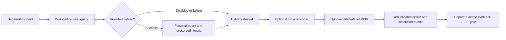

# Query rewriting and final reranker ordering

Ali's allocation is query rewriting and “Use byversity for reranker.” Exact-name
research did not identify a published model. Ali confirmed diversity/MMR as the
working interpretation on 2026-10-01 and authorized implementation. The original
chat spelling is retained as history; its author's intent is not independently
verified. This PR implements article-level MMR alongside the existing MiniLM
cross-encoder, rather than inventing a model called “byversity.” Ali also expanded
this same PR to BUG-001–BUG-012; see `incident_bug_fixes.md`.

## What exists and why

The retrieve node originally concatenated the sanitized title/body and capped
it at 1,000 characters. FastEmbed uses `BAAI/bge-small-en-v1.5` dense embeddings
and `Qdrant/bm25` sparse retrieval, fused with RRF. The cross-encoder is
`Xenova/ms-marco-MiniLM-L-6-v2`, enabled by `RETRIEVAL_MODE=hybrid_reranked`.
Its FastEmbed/ONNX compatibility fits the existing runtime. No comparative
model-selection rationale was found: compatibility is not proof of superiority.
Read-only EC2 inspection on 2026-10-01 found both API and worker configured for
`hybrid_reranked` with MiniLM, at main `41cfbc4`; local defaults use plain hybrid.
No deployed configuration was changed. Main still loses the model's ordering
downstream; this PR repairs that boundary.

Dense cosine and reranker scores have different jobs. RRF rank sums and sigmoid
cross-encoder scores cannot be interpreted as calibrated confidence. The final
agent now preserves cross-encoder ordering instead of sorting it away by cosine.
Cosine remains the separate evidence sufficiency gate; its threshold is not
transferred to a differently scaled score. Evidence filters and index vectors
remain unchanged.

## Actual rewrite behavior

With `AGENT_QUERY_REWRITE_ENABLED=true`, one structured Gemini call extracts the
faults/services from the incident and removes greetings, signatures, repetition
and administrative chatter. The prompt preserves independently reported issues
and forbids invented causes, diagnoses or fixes. Deterministic anchors retain
literal error/status codes, versions and explicit negated clauses when omitted.
These anchors do not prove complete semantic faithfulness; evaluation remains
necessary. A successful focused query does **not** append the noisy source again.
The source incident remains in the workflow audit.

Rewriting has a dedicated five-second transport timeout and zero SDK retries.
Invalid/blank output, timeouts and other failures use the original query. The final
focused query plus complete anchors is capped at 600 characters; if all anchors
cannot fit, the original query is retained without cutting a negation or literal. Trace
metadata records status and exception type without provider exception text.
Existing redaction is used; this does not implement Ahmed's second PII layer.
The feature remains opt-in because it adds model latency and the demonstrated
benefit is on synthetic administrative noise, rather than a full new KB test set.



## Measured results

The read-only harness uses the actual `QdrantRetriever`, including scoped/wide
passes, final bundling/capacity and sufficiency. It makes real Gemini calls and
uses real local embedding/reranking models. Its 29 article-ID cases contain 23
answerable and six unanswerable incidents against 47 points. Primary IDs exist;
point-ID/payload fingerprints match before/after. Vectors are not fingerprinted.
Six OCR/layout/table stressors remain excluded because their section IDs are not
mapped to articles. Classification comes from the expected article's category;
this is a retrieval comparison, not classifier or full-resolution evaluation.

| Corpus queries | Hit@1 | Hit@5 | Primary recall | MRR | p50 |
|---|---:|---:|---:|---:|---:|
| Hybrid original | 91.3% | 95.7% | 95.7% | 0.935 | 12 ms |
| Hybrid focused | 91.3% | 95.7% | 95.7% | 0.935 | 2,603 ms |
| MiniLM original | 91.3% | 100% | 100% | 0.957 | 198 ms |
| MiniLM focused | 91.3% | 100% | 100% | 0.957 | 2,731 ms |

`docs/evidence/retrieval_query_ablation_focused.json` records that comparison.
Every variant surfaces zero forbidden IDs; one of six unanswerable cases still
passes the evidence gate. This limitation is visible, not labelled a resolution
success. The earlier append-original experiment is retained in
`retrieval_query_ablation.json` as historical evidence: it regressed reranked
recall and was replaced by the focused approach.

A second run deterministically wraps each labelled incident in repeated
administrative email boilerplate. The exact synthetic queries are exported in
`docs/evidence/retrieval_query_ablation_noisy.json`; this is not production data.

| Synthetic noise | Hit@1 | Hit@5 | Primary recall | MRR | p50 |
|---|---:|---:|---:|---:|---:|
| Hybrid original | 60.9% | 91.3% | 84.8% | 0.754 | 24 ms |
| Hybrid focused | 91.3% | 95.7% | 93.5% | 0.935 | 2,814 ms |
| MiniLM original | 17.4% | 34.8% | 32.6% | 0.246 | 399 ms |
| MiniLM focused | 87.0% | 100% | 100% | 0.928 | 2,981 ms |

Under this noise, false evidence-gate passes fall from five to one of six
unanswerable cases; forbidden IDs remain zero. Rewriting produces real retrieval
improvement here, not just successful fallback. It still costs about three
seconds, and model nondeterminism and this small synthetic set limit the claim.
These results benchmark the existing MiniLM; the diversity/MMR comparison follows below.

Reproduce each variant with:

```sh
uv run python -m eval.agent_retrieval_ablation --rewrite \
  --output docs/evidence/retrieval_query_ablation_focused.json
uv run python -m eval.agent_retrieval_ablation --rewrite --noisy \
  --output docs/evidence/retrieval_query_ablation_noisy.json
```

## Diversity/MMR implementation and decision

`RETRIEVAL_MMR_ENABLED=true` applies MMR to one representative per article after
scoped/wide candidate merging and before Resolution bundling. It balances the
existing query relevance score against the maximum positive cosine similarity to
already-selected articles. In reranked mode, query relevance is the cross-encoder
score; in hybrid mode it is dense cosine. The default lambda is 0.8: higher means
more emphasis on relevance; 1 preserves the previous order without vector reads.

Only articles that already clear the existing category-aware cosine gate are
reordered. Other articles keep their rank slots. The strongest eligible match
stays first. Exact version/chunk vectors are read from Qdrant using publication
and security filters; no re-embedding, new model, provider call or index mutation
is needed. Missing/invalid vectors raise a contract error; transport outages are
retryable and are not disguised as successful MMR. Companion sections are added
in the existing bundle order, within the unchanged top-k capacity. In particular,
MMR does not penalize a Cause and Resolution pair for being similar.

`RetrievalResult.mmr_applied` and `mmr_lambda` record the actual path in the
checkpoint/node audit. Disabled mode does no diversity vector work. MMR remains
**off by default**: the same algorithm improves some variants and regresses others.
That is a measured deployment choice, not a fallback standing in for implementation.

`retrieval_mmr_ablation.json` and `retrieval_mmr_ablation_noisy.json` compare on/off
using the same snapshot and previously recorded original/focused queries. They
make no new rewrite calls. Their latency is warm retrieval only, excluding query
rewrite generation, and must not be compared as end-to-end latency against the
older rewrite-inclusive tables. No tuning/held-out split is claimed: lambda 0.8
was fixed before the comparison. The manual stressors remain unmapped.

| Query set / mode | Primary recall, MMR off | Primary recall, MMR on |
|---|---:|---:|
| Clean hybrid, original | 95.7% | 95.7% |
| Clean hybrid, focused | 95.7% | 100% |
| Clean MiniLM, original | 100% | 95.7% |
| Clean MiniLM, focused | 100% | 97.8% |
| Synthetic-noise hybrid, original | 84.8% | 89.1% |
| Synthetic-noise hybrid, focused | 93.5% | 95.7% |
| Synthetic-noise MiniLM, focused | 100% | 89.1% |

MMR changes real returned article order. All variants retain zero forbidden IDs;
false evidence passes remain one of six for clean/focused queries and five of six
for noisy originals. The miniature set does not prove production or new-KB quality.
Keep the deployed cross-encoder's diversity switch off until new-KB held-out
multi-issue labels support a benefit. Hybrid+MMR is a promising lower-cost candidate,
not a declared universal winner. Relevance reranking and diversity selection solve
different problems, so a larger relevance model is not automatically necessary.

The live reproducer now enables MMR. Its approved PDI incident `INC0010043` records
`mmr_applied=true`, lambda 0.8 in PostgreSQL and completes via stored-draft approval.
The separate high-risk incident `INC0010044` never reaches retrieval; its empty
approval returns 409 and rejection closes it as failed. Both retain single-trace
Langfuse evidence through resumed ServiceNow writes. These artifacts prove operation,
not improved production resolution accuracy.

Reproduce MMR with the fixed focused-query artifacts:

```sh
uv run python -m eval.agent_retrieval_ablation --mmr \
  --queries-from docs/evidence/retrieval_query_ablation_focused.json \
  --output docs/evidence/retrieval_mmr_ablation.json
uv run python -m eval.agent_retrieval_ablation --mmr --noisy \
  --queries-from docs/evidence/retrieval_query_ablation_noisy.json \
  --output docs/evidence/retrieval_mmr_ablation_noisy.json
```

Rollback switches are `RETRIEVAL_MMR_ENABLED=false`,
`AGENT_QUERY_REWRITE_ENABLED=false`, and `RETRIEVAL_MODE=hybrid`; restart processes
to clear cached settings/models. No re-ingestion is required by these changes.

## Research sources

- [Rewrite–Retrieve–Read](https://aclanthology.org/2023.emnlp-main.322/) motivates
  rewriting user language into retrieval terms; its results do not prove BARQ quality.
- [FastEmbed rerankers](https://qdrant.tech/documentation/fastembed/fastembed-rerankers/)
  and the [MiniLM model card](https://huggingface.co/Xenova/ms-marco-MiniLM-L-6-v2)
  explain the current supported cross-encoder and runtime.
- [BGE reranker documentation](https://bge-model.com/Introduction/reranker.html)
  explains joint query/document scoring; it does not identify the requested model.
- [MMR's original paper](https://www.cs.cmu.edu/~jgc/publication/The_Use_MMR_Diversity_Based_LTMIR_1998.pdf)
  describes a relevance/diversity selection algorithm, not a cross-encoder model.
