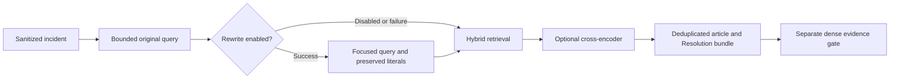

# Query rewriting and final reranker ordering

Ali's allocation is query rewriting and “Use byversity for reranker.” That spelling
still does not identify a model reliably; the exact model ID/link remains needed.
This PR does not silently substitute BGE, MMR or another provider. The current
MiniLM model remains in place and was measured. Ali subsequently expanded this
same PR to BUG-001–BUG-012; see `incident_bug_fixes.md` for that work.

## What exists and why

The retrieve node originally concatenated the sanitized title/body and capped
it at 1,000 characters. FastEmbed uses `BAAI/bge-small-en-v1.5` dense embeddings
and `Qdrant/bm25` sparse retrieval, fused with RRF. The cross-encoder is
`Xenova/ms-marco-MiniLM-L-6-v2`, enabled by `RETRIEVAL_MODE=hybrid_reranked`.
Its FastEmbed/ONNX compatibility fits the existing runtime. No comparative
model-selection rationale was found: compatibility is not proof of superiority.
EC2's effective configuration was not inspected or changed for this PR.

Dense cosine and reranker scores have different jobs. RRF rank sums and sigmoid
cross-encoder scores cannot be interpreted as calibrated confidence. The final
agent now preserves cross-encoder ordering instead of sorting it away by cosine.
Cosine remains the separate evidence sufficiency gate; its threshold is not
transferred to a differently scaled score. Evidence filters and index vectors
remain unchanged.

## Actual rewrite behavior

With `AGENT_QUERY_REWRITE_ENABLED=true`, one structured Gemini call extracts the
faults/services from the incident and removes greetings, signatures, repetition
and administrative chatter. The prompt preserves independently reported issues
and forbids invented causes, diagnoses or fixes. Deterministic anchors retain
literal error/status codes, versions and explicit negated clauses when omitted.
These anchors do not prove complete semantic faithfulness; evaluation remains
necessary. A successful focused query does **not** append the noisy source again.
The source incident remains in the workflow audit.

Rewriting has a dedicated five-second transport timeout and zero SDK retries.
Invalid/blank output, timeouts and other failures use the original query. Trace
metadata records status and exception type without provider exception text.
Existing redaction is used; this does not implement Ahmed's second PII layer.
The feature remains opt-in because it adds model latency and the demonstrated
benefit is on synthetic administrative noise, rather than a full new KB test set.



## Measured results

The read-only harness uses the actual `QdrantRetriever`, including scoped/wide
passes, final bundling/capacity and sufficiency. It makes real Gemini calls and
uses real local embedding/reranking models. Its 29 article-ID cases contain 23
answerable and six unanswerable incidents against 47 points. Primary IDs exist;
point-ID/payload fingerprints match before/after. Vectors are not fingerprinted.
Six OCR/layout/table stressors remain excluded because their section IDs are not
mapped to articles. Classification comes from the expected article's category;
this is a retrieval comparison, not classifier or full-resolution evaluation.

| Corpus queries | Hit@1 | Hit@5 | Primary recall | MRR | p50 |
|---|---:|---:|---:|---:|---:|
| Hybrid original | 91.3% | 95.7% | 95.7% | 0.935 | 12 ms |
| Hybrid focused | 91.3% | 95.7% | 95.7% | 0.935 | 2,603 ms |
| MiniLM original | 91.3% | 100% | 100% | 0.957 | 198 ms |
| MiniLM focused | 91.3% | 100% | 100% | 0.957 | 2,731 ms |

`docs/evidence/retrieval_query_ablation_focused.json` records that comparison.
Every variant surfaces zero forbidden IDs; one of six unanswerable cases still
passes the evidence gate. This limitation is visible, not labelled a resolution
success. The earlier append-original experiment is retained in
`retrieval_query_ablation.json` as historical evidence: it regressed reranked
recall and was replaced by the focused approach.

A second run deterministically wraps each labelled incident in repeated
administrative email boilerplate. The exact synthetic queries are exported in
`docs/evidence/retrieval_query_ablation_noisy.json`; this is not production data.

| Synthetic noise | Hit@1 | Hit@5 | Primary recall | MRR | p50 |
|---|---:|---:|---:|---:|---:|
| Hybrid original | 60.9% | 91.3% | 84.8% | 0.754 | 24 ms |
| Hybrid focused | 91.3% | 95.7% | 93.5% | 0.935 | 2,814 ms |
| MiniLM original | 17.4% | 34.8% | 32.6% | 0.246 | 399 ms |
| MiniLM focused | 87.0% | 100% | 100% | 0.928 | 2,981 ms |

Under this noise, false evidence-gate passes fall from five to one of six
unanswerable cases; forbidden IDs remain zero. Rewriting produces real retrieval
improvement here, not just successful fallback. It still costs about three
seconds, and model nondeterminism and this small synthetic set limit the claim.
These results do not identify or benchmark the requested “byversity” model.

Reproduce each variant with:

```sh
uv run python -m eval.agent_retrieval_ablation --rewrite \
  --output docs/evidence/retrieval_query_ablation_focused.json
uv run python -m eval.agent_retrieval_ablation --rewrite --noisy \
  --output docs/evidence/retrieval_query_ablation_noisy.json
```

Before replacing the reranker, confirm its exact identifier/runtime and compare
it on the same snapshot, then on the newly ingested KB with mapped manual/table
ground truth. Rollback switches are `AGENT_QUERY_REWRITE_ENABLED=false` and
`RETRIEVAL_MODE=hybrid`; restart processes to clear cached settings/models.
No re-ingestion is required by these changes.

## Research sources

- [Rewrite–Retrieve–Read](https://aclanthology.org/2023.emnlp-main.322/) motivates
  rewriting user language into retrieval terms; its results do not prove BARQ quality.
- [FastEmbed rerankers](https://qdrant.tech/documentation/fastembed/fastembed-rerankers/)
  and the [MiniLM model card](https://huggingface.co/Xenova/ms-marco-MiniLM-L-6-v2)
  explain the current supported cross-encoder and runtime.
- [BGE reranker documentation](https://bge-model.com/Introduction/reranker.html)
  explains joint query/document scoring; it does not identify the requested model.
- [MMR's original paper](https://www.cs.cmu.edu/~jgc/publication/The_Use_MMR_Diversity_Based_LTMIR_1998.pdf)
  describes a relevance/diversity selection algorithm, not a cross-encoder model.
