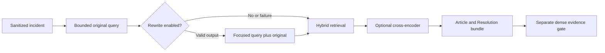

# Retrieval query rewriting and reranking

Aya's September 29 allocation gives Ali query rewriting and “Use byversity for
reranker.” The supplied spelling does not identify a model reliably. Its exact
model ID/link still needs confirmation; this change does **not** substitute BGE,
MMR, or another provider for that requirement. Keep this PR in draft until that
choice and the resulting model verification are complete. KB ingestion/DeepEval,
semantic caching, and second-layer PII detection belong to the other owners.

## Existing behavior and why it matters

The retrieve node previously concatenated the sanitized short description and
body, capped at 1,000 characters. It had no rewriting call. FastEmbed uses
`BAAI/bge-small-en-v1.5` and `Qdrant/bm25`; hybrid search fuses dense and sparse
candidates with RRF. The configured cross-encoder is
`Xenova/ms-marco-MiniLM-L-6-v2`, enabled only with
`RETRIEVAL_MODE=hybrid_reranked`. Local effective mode was `hybrid` when checked;
EC2's current configuration was not inspected.

The MiniLM model is supported by the existing FastEmbed adapter, and its local
ONNX execution fits the existing stack. Those are practical compatibility
reasons, **not evidence that it is the best model for this KB**. No comparative
model-selection rationale was found in its introducing change. The historical
Sprint 2 ablation evaluated the lower-level search entry point, not the final
agent evidence bundle. Its results cannot establish performance for the final
agent or newly ingested manual corpus.

The agent searched scoped and wide candidates, then ranked articles and their
best chunks by dense cosine. That discarded the cross-encoder ordering. In
reranked mode, article/chunk selection now uses its cross-encoder score;
ordinary hybrid retains dense ordering. Complementary Resolution chunks still
travel with a selected article, and final output respects `top_k` exactly.
The dense cosine evidence gate and the out-of-category margin remain separate.
Sigmoid-bounded reranker scores are not calibrated confidence probabilities.

## Query augmentation

`AGENT_QUERY_REWRITE_ENABLED=true` adds one structured Gemini call in the existing
retrieve node. The prompt asks for concise search terms grounded in the sanitized
incident, preserving symptoms, products, versions, literal errors and negations.
Its result is capped at 600 characters, redacted and schema-validated. The original
bounded query is appended in full, so rewriting cannot silently remove its error
literals or negations. The model has no tools and does not decide evidence gates.

A timeout, refusal, provider error, invalid/blank/oversized response, or unusable
response restores the original query. An unchanged result is not duplicated.
`AGENT_QUERY_REWRITE_TIMEOUT_SECONDS=5` sets the OpenAI client's **transport**
timeout for this purpose, with zero SDK retries; it is not an absolute wall-clock
cancellation guarantee. Other model calls retain their existing retry/timeout
settings. The existing tracing generation records model usage, and the rewrite
span records augmented/unchanged/fallback plus exception type, never exception
text. This uses existing redaction and does not replace Ahmed's PII work.

Retaining the source does not prove a model-generated query is faithful, nor
that its additional terms improve retrieval. Adding search terms changes the
embedding and therefore can change the cosine gate outcome. Evaluate before
turning it on. The checked-in default is **false** because the live comparison
below does not justify enabling it.



## Live evaluation evidence

Run from the repository root:

```sh
uv run python -m eval.agent_retrieval_ablation --rewrite \
  --output docs/evidence/retrieval_query_ablation.json
```

The harness reads the existing index without writing to it or calling ServiceNow.
It runs the **actual QdrantRetriever**, including scoped/wide passes, article
bundling, final capacity and sufficiency gate. It compares original/augmented
queries and hybrid/reranked modes independently. Model warmup is excluded;
augmentation latency includes the single real Gemini call reused for both modes.
The harness exports evaluation IDs, returned article IDs and scores, never KB text
or credentials. Future runs also record the evaluation queries for inspection.

The committed October 1 artifact covers 29 article-ID cases: 23 answerable and
six unanswerable, against 47 local index points. All expected primary IDs were
present. Point-ID/payload fingerprints matched before and after; vectors were
not fingerprinted. Six OCR/layout/table stressors are explicitly excluded because
their section IDs lack an article mapping; this is **not full manual KB coverage**.
Classification comes from each primary article's indexed category, or `other`
when absent. This isolates retrieval and does not evaluate classifier accuracy.

| Final-agent variant | Hit@1 | Hit@5 | Primary recall | MRR | p50 | p95 |
|---|---:|---:|---:|---:|---:|---:|
| Hybrid, original | 91.3% | 95.7% | 95.7% | 0.935 | 11 ms | 15 ms |
| Hybrid, augmented | 91.3% | 95.7% | 95.7% | 0.935 | 2,672 ms | 3,342 ms |
| MiniLM reranked, original | 91.3% | 100% | 100% | 0.957 | 191 ms | 228 ms |
| MiniLM reranked, augmented | 87.0% | 95.7% | 93.5% | 0.906 | 2,861 ms | 3,539 ms |

25/29 queries were augmented; unchanged/fallback queries use the original.
Every variant surfaced zero forbidden IDs and passed the evidence gate on one
of six unanswerable cases. That is a pre-existing gate false positive in this
snapshot, not a resolution-correctness result. No generated resolutions were
scored. The augmented reranked variant regressed, so query augmentation remains
opt-in. The existing reranker improved recall at higher latency; this does not
identify or benchmark the requested “byversity” model. No production setting was
changed, and no EC2 or ServiceNow end-to-end execution was run for this change.

## Validation and rollout

New tests exercise source/negation preservation, redaction, disabled mode,
invalid output, fallback, purpose-specific SDK timeout/retries, the retrieve node,
and full graph completion with both successful rewriting and a timeout. Rank
regressions deliberately make dense and reranker scores disagree; they check both
covered and uncovered category routes, complementary sections, capacity and
cosine gating. Existing access-filter and graph suites also run.

Local checks: locked dependency sync; whole-repo ruff and format check; mypy;
1,402 default tests passed (41 environment-gated skips, 20 integration cases
selected separately); all 20 PostgreSQL/Redis integration cases passed; all 41
isolated database/audit/idempotency checks passed; 14 manual-parser tests passed
with the real reference PDF temporarily linked. The PDF link was removed afterward.
ServiceNow live opt-in tests were not enabled for this read-only retrieval change.

The first SDK CI run failed its npm audit before building: the existing lockfile
contained a newly reported high-severity brace-expansion vulnerability. A separate
build-only fix updates its four resolved entries to compatible patches (1.1.21,
2.1.7, 5.0.12), retaining SDK 4.8.0 and all other packages/platform metadata.
Node 22.23.3 was used locally. The high-severity audit gate, frozen-key SDK build,
28 SDK tests and exported-record comparison pass; nine moderate findings remain.
The [upstream advisory](https://github.com/advisories/GHSA-qhr7-859c-m2p7)
documents the patched versions. No audit threshold was relaxed.

Before merge: confirm the exact requested reranker and its supported runtime,
run it on the same snapshot and inspect changed queries, then repeat against the
team's new ingested KB with mapped OCR/table ground truth. Require PR checks and
review on the final head. Configuration rollback is
`AGENT_QUERY_REWRITE_ENABLED=false` and `RETRIEVAL_MODE=hybrid`; process restart
clears cached settings/models. Dense embeddings and the existing index format
are unchanged; this change does not require re-ingestion.

## Research sources

- [Rewrite–Retrieve–Read paper](https://aclanthology.org/2023.emnlp-main.322/):
  query rewriting addresses the mismatch between user input and retrieval terms;
  its paper results do not guarantee improvement on BARQ.
- [FastEmbed reranker documentation](https://qdrant.tech/documentation/fastembed/fastembed-rerankers/)
  and the [MiniLM ONNX model card](https://huggingface.co/Xenova/ms-marco-MiniLM-L-6-v2):
  confirm compatibility of the current model, rather than its superiority.
- [BGE reranker explanation](https://bge-model.com/Introduction/reranker.html):
  a cross-encoder jointly scores query/document candidates. This does not confirm
  BGE as the requested model.
- [Qdrant search relevance documentation](https://qdrant.tech/documentation/concepts/search-relevance/):
  MMR is a relevance/diversity algorithm and its native support starts at 1.15.
  The repo pins Qdrant 1.14.0; neither MMR nor an upgrade is part of this change.
