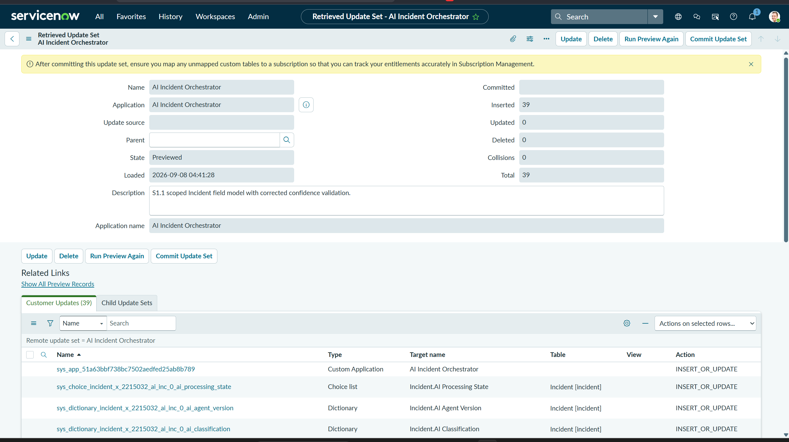
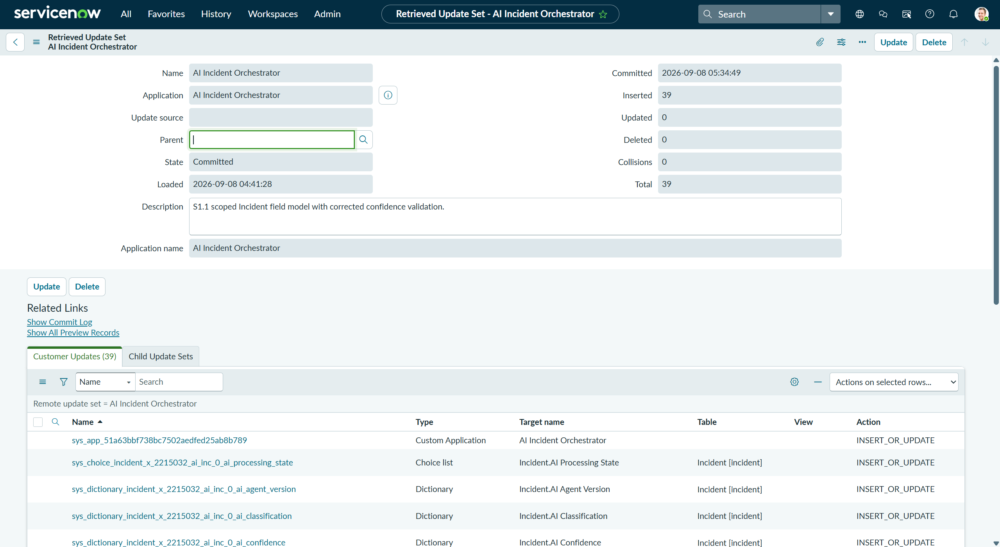
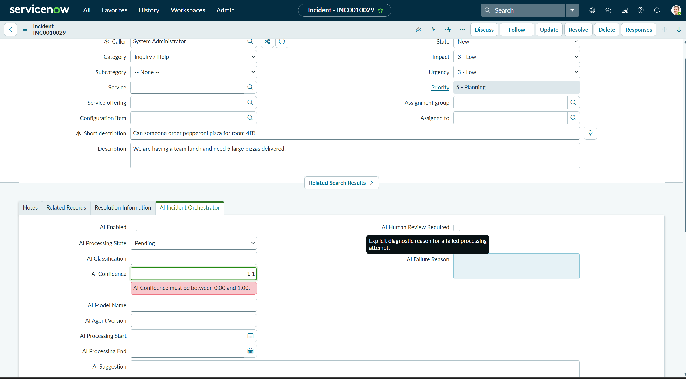

# S1.1 Secondary-PDI Clean-Import Verification

## Result

The final `ai_incident_orchestrator_s1_1.xml` package was imported into authorized teammate PDI `dev204871`, running the same ServiceNow Australia release as the source PDI. The package previewed and committed cleanly without collision resolution, skipped-record handling, manual configuration, or repair.

| Verification point | Result |
|---|---|
| Retrieved update set | AI Incident Orchestrator |
| Preview state | Previewed |
| Inserted | 39 |
| Updated | 0 |
| Deleted | 0 |
| Collisions | 0 |
| Manual repairs | None |
| Commit state | Committed |
| Commit timestamp | 2026-09-08 05:34:49 on the secondary PDI |
| Post-import form test | Passed |
| Post-import confidence validation | Passed; entering out-of-range `1.1` displayed the expected range error. Screenshot `09` captures the error at the moment it appears, with `1.1` still in the field; the field is cleared on the subsequent onSubmit/onChange pass, which is not captured |

## Evidence

### Clean preview

The preview shows state **Previewed**, 39 inserted records, zero updates, zero deletions, and zero collisions.

### Successful commit

The committed record shows state **Committed**, the commit timestamp, 39 inserted records, and zero updates, deletions, or collisions.

### Post-import functional verification

An existing Incident on `dev204871` displayed the imported AI Incident Orchestrator section and fields. The imported Client Script displayed the expected range error for an out-of-range confidence value. The captured screenshot shows the error while `1.1` is still in the field; the clearing step itself is not captured.

