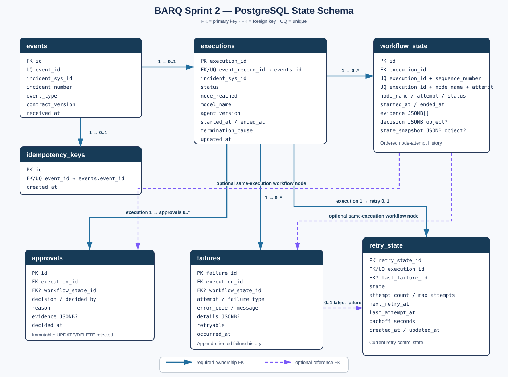

# Sprint 2 PostgreSQL State Schema

## Purpose and scope

Sprint 2 task S2.2 introduces the PostgreSQL persistence boundary for accepted
incident events and their agent executions. The schema has exactly seven tables:
`events`, `idempotency_keys`, `executions`, `workflow_state`, `approvals`, `failures`,
and `retry_state`.

This document describes the schema in migration
`0001_create_postgresql_state_schema.py`, its SQLAlchemy mapping, the atomic event
acceptance repository, execution-audit reconstruction, and the boundary between
transactional application state and Qdrant knowledge retrieval. It does not claim an
HTTP/webhook integration, Redis/Celery coordination, or an implemented archival job.

## State ownership

PostgreSQL is authoritative for transactional application state:

- inbound event receipts and idempotency claims;
- execution summaries and workflow-node attempt history;
- final approval decisions and failure history; and
- current retry-control state.

Qdrant is authoritative only for the vectorized knowledge corpus used by retrieval.
Its points contain article/chunk content and retrieval metadata, not the seven-table
execution state. ServiceNow remains outside this schema's ownership boundary.

## Schema overview

The design deliberately does not collapse all state into `events`. Receipt of an
external event is different from running it; an execution has many ordered workflow
attempts, approval and failure records are audit facts, retry control is a mutable
current-state projection, and idempotency is a concurrency gate. Separate relations
make those lifecycles explicit and allow PostgreSQL to enforce their cardinalities,
checks, foreign keys, uniqueness, and transaction boundaries.

## Table responsibilities

| Table | Role and lifecycle | Important keys, relationships, and constraints | Why separate |
|---|---|---|---|
| `events` | Historical copy of each accepted four-field inbound event, plus `contract_version` and `received_at`. | PK `id`; unique `event_id`; `event_type` is `incident.created` or `incident.updated`; indexed by `incident_sys_id` and `received_at`. One event has at most one idempotency key and one execution. | Preserves receipt identity and source context independently of mutable execution progress. |
| `idempotency_keys` | Durable claim for an external `event_id`; historical for as long as replay prevention is required. | PK `id`; unique `event_id`; deferred FK from `event_id` to `events.event_id`; `created_at`. | Lets a single database uniqueness constraint arbitrate concurrent delivery before the event row is inserted in the same transaction. |
| `executions` | Mutable summary of the one execution accepted for an event. | PK `execution_id`; unique FK `event_record_id` to `events.id`; `incident_sys_id`, status, latest `node_reached`, model/agent metadata, start/end/termination fields, and `updated_at`. Checks couple terminal status to non-null `ended_at` and `termination_cause`. | Keeps execution lifecycle and denormalized current summary apart from immutable event receipt and detailed history. |
| `workflow_state` | Append/history-oriented result of each workflow-node attempt. | PK `id`; FK `execution_id`; unique `(execution_id, sequence_number)` and `(execution_id, node_name, attempt)`; positive sequence/attempt; status/time checks. `evidence` must be a JSONB array; `decision` and `state_snapshot`, when present, must be JSONB objects. | Preserves ordered attempt-level timings, evidence, decisions, and snapshots instead of overwriting the execution summary. |
| `approvals` | Historical final approval decisions. Pending requests are not represented here. | PK `id`; restrictive FK `execution_id`; optional `workflow_state_id` with a composite FK ensuring the node belongs to the same execution; decision check; execution/time index. Database trigger rejects UPDATE and DELETE. | Approval decisions are immutable audit facts with a lifecycle and mutation policy distinct from workflow progress. |
| `failures` | Append-oriented execution- or node-level failure history. | PK `failure_id`; FK `execution_id`; optional same-execution composite FK to `workflow_state`; positive `attempt`; retryable flag; execution/time index. | Multiple failures and attempts must remain independently attributable and ordered; they are not just the execution's latest error. |
| `retry_state` | Mutable **current** retry-control state for an execution. | PK `retry_state_id`; unique FK `execution_id` (zero or one row per execution); optional same-execution FK to `last_failure_id`; attempt, scheduling, backoff, and state consistency checks; partial due-retry index. | Efficient scheduling needs one current control row, while `failures` retains the historical failure facts. It is not a retry-transition log. |

All timestamp columns use timezone-aware PostgreSQL timestamps (`TIMESTAMPTZ`).

## Relationship rationale

An `events` row is the durable receipt. Its unique `event_record_id` relationship
allows zero or one `executions` row, while the execution owns zero or more
`workflow_state`, `approvals`, and `failures` rows and zero or one `retry_state` row.
Optional node links on approvals and failures use composite foreign keys so a child
cannot point to a workflow node from another execution. `retry_state.last_failure_id`
has the same same-execution protection.

The execution's `node_reached` is only a latest-node summary. The authoritative
ordered history is `workflow_state`.

## Idempotency design

`event_id` is the external idempotency identifier. The canonical implementation is
`accept_inbound_event()` in `src/app/repositories/idempotency.py`:

1. Start one session and one transaction.
2. INSERT an `idempotency_keys` row and flush it. There is no SELECT-before-INSERT.
3. PostgreSQL arbitrates concurrent callers through
   `uq_idempotency_keys_event_id`.
4. INSERT and flush the `events` row, then INSERT and flush its initial `executions`
   row.
5. Commit the key, event, and execution atomically.

Only an `IntegrityError` whose structured PostgreSQL constraint name is exactly
`uq_idempotency_keys_event_id` becomes `DUPLICATE`; other integrity failures
propagate. If event or execution persistence fails after the claim is flushed, the
transaction rollback removes the claim too, so a corrected delivery can be retried.

The concurrency tests exercise independent sessions with the same `event_id`. For
both the two-worker race and five-worker stress race, exactly one caller is
`ACCEPTED`, every other caller is `DUPLICATE`, and the database contains exactly one
idempotency key, event, and execution. Replay and payload-variation tests also prove
that a later duplicate does not overwrite the winning event.

## Transaction boundary and concurrency behavior

`accept_inbound_event()` owns its transaction. The deferred foreign key from
`idempotency_keys.event_id` to `events.event_id` permits the claim INSERT to flush
first while still requiring the corresponding event by commit. This ordering makes
the unique claim the concurrency gate without sacrificing referential integrity.

The session factory disables autoflush and keeps objects usable after commit. The
repository performs explicit flushes at the points where IDs and uniqueness outcomes
are needed. No process-local lock is part of the correctness model.

## Workflow and audit history

`workflow_state` records each node attempt with a stable sequence, attempt number,
status, timestamps, evidence, decision, and optional state snapshot. `approvals` and
`failures` can attach to a particular node attempt or to the execution generally.
This preserves facts needed for reconstruction while `executions` remains the compact
current summary.

JSONB fields should contain only information required to explain and reconstruct the
workflow. Secrets, access tokens, credentials, and unrelated incident data must never
be stored in `evidence`, `decision`, `state_snapshot`, approval `evidence`, or failure
`details`.

## Immutable approvals

PostgreSQL function `barq_reject_approval_mutation()` is installed by the migration,
and trigger `trg_approvals_immutable` invokes it before every UPDATE or DELETE on
`approvals`:

- INSERT is allowed;
- SELECT is allowed;
- UPDATE is rejected; and
- DELETE is rejected.

The trigger uses SQLSTATE `55000`. It protects audit history independently of ORM or
application behavior: ordinary SQL cannot silently overwrite or remove a historical
approval decision. The schema stores final decisions only; it does not model a
mutable pending-approval request.

## Database-managed `updated_at`

Function `barq_set_updated_at()` assigns `clock_timestamp()` on UPDATE. It is used by
`trg_executions_set_updated_at` and `trg_retry_state_set_updated_at`. Consequently,
both ORM updates and direct SQL updates advance `updated_at`; correctness does not
depend solely on SQLAlchemy's `onupdate` behavior.

## Failure and retry model

`failures` is the append-oriented record of what failed, on which attempt, when, and
whether it was considered retryable. `retry_state` is the current operational control
record: state, attempt budget and count, next/last attempt timestamps, latest failure,
and backoff. Its checks prevent negative/excess attempts and inconsistent active,
exhausted, or scheduled states.

Known limitation: `retry_state` does not preserve historical retry-state transitions.
Audit reconstruction can show all retained failure records and the current retry
control state, but not every earlier value that the `retry_state` row held. This is
consistent with the approved current-state design.

## Audit reconstruction

`reconstruct_execution(execution_id)` in `src/app/repositories/audit.py` returns
`None` for an unknown execution or a frozen `ExecutionAudit` containing:

- the originating event context;
- execution metadata, start/end timing, derived duration, and stored
  `termination_cause`;
- ordered workflow attempts with timing/duration, evidence, decisions, and snapshots;
- ordered immutable approvals;
- ordered failures; and
- the optional current retry state.

Ordering is deterministic: workflow rows use `(sequence_number, attempt, started_at,
id)`, approvals use `(decided_at, id)`, and failures use `(occurred_at, failure_id)`.
The repository deep-copies JSON values before returning them.

### Sample audit query

The primary execution/event/workflow query can be expressed as:

```sql
SELECT
    x.execution_id,
    x.event_record_id,
    x.incident_sys_id,
    x.status AS execution_status,
    x.node_reached,
    x.model_name,
    x.agent_version,
    x.started_at AS execution_started_at,
    x.ended_at AS execution_ended_at,
    x.termination_cause,
    x.updated_at,
    e.event_id,
    e.incident_number,
    e.event_type,
    e.contract_version,
    e.received_at,
    ws.id AS workflow_state_id,
    ws.sequence_number,
    ws.node_name,
    ws.attempt,
    ws.status AS workflow_status,
    ws.started_at AS workflow_started_at,
    ws.ended_at AS workflow_ended_at,
    ws.evidence,
    ws.decision,
    ws.state_snapshot
FROM executions AS x
JOIN events AS e
  ON e.id = x.event_record_id
LEFT JOIN workflow_state AS ws
  ON ws.execution_id = x.execution_id
WHERE x.execution_id = :execution_id
ORDER BY
    ws.sequence_number,
    ws.attempt,
    ws.started_at,
    ws.id;
```

The repository queries `approvals`, `failures`, and `retry_state` separately. This
avoids a wide join multiplying workflow, approval, and failure rows into a cartesian
history that would then need error-prone de-duplication.

## PostgreSQL vs Qdrant separation

Transactional workflow state requires atomic commits, uniqueness and check
constraints, foreign-key integrity, deterministic audit relationships, and reliable
replay/idempotency arbitration. PostgreSQL supplies those properties and owns the
seven tables. Qdrant supplies dense/sparse vector search, payload filtering, and
knowledge-chunk retrieval; it is not used as a transaction log or workflow database.

Keeping the boundary explicit also minimizes data exposure: Qdrant should contain
only content and metadata necessary for knowledge retrieval. Runtime event,
execution, approval, failure, retry, and idempotency records stay in PostgreSQL.

## Qdrant payload inspection evidence

The following repository paths were inspected:

- `src/app/models/knowledge.py`: `Article`, the KB-lifecycle `WorkflowState` enum,
  `KnowledgePayload.from_chunk()`, and `to_qdrant_payload()`;
- `src/app/retrieval/ingest.py`: the only Qdrant `PointStruct` construction and upsert
  path;
- `src/app/clients/qdrant.py`: collection vectors and payload keyword indexes;
- `src/app/retrieval/search.py`: payload validation and mandatory published/security
  filters;
- `tests/retrieval/test_ingest.py`, `tests/retrieval/test_search.py`, and
  `tests/models/test_knowledge.py`: payload-contract and filtering assertions; and
- `data/corpus/barq_articles.json`: representative source records.

The ingestion path currently writes these fields for every point:

`article_number`, `version`, `title`, `category`, `service`, `workflow_state`,
`security_level`, `section`, `chunk_index`, `total_chunks`, `chunk_text`,
`related_records`, and computed `article_id`.

It conditionally writes `sys_id`, `owner`, `author`, and `reviewed_on` when present.
`KnowledgePayload` also defines optional `article_url`, but `from_chunk()` does not
populate it, so the current ingestion path omits it. The indexed payload fields are
`category`, `service`, `workflow_state`, `version`, `security_level`, `article_id`,
and `article_number`.

In this knowledge model, optional `sys_id` is the published KB article's ServiceNow
identifier, not an incident identifier. Values such as incident numbers inside
`related_records` are static cross-references authored into a knowledge article, not
runtime event or execution records.

The Qdrant field named `workflow_state` is knowledge-domain lifecycle metadata. Its
closed values are `draft`, `published`, and `retired`, mirroring the knowledge-base
article lifecycle; retrieval requires `published`. It is unrelated to the PostgreSQL
table also named `workflow_state`, whose rows represent live execution-node attempts
and use statuses such as `started`, `succeeded`, and `failed`.

Repository-wide inspection of the Qdrant model, ingestion, search, tests, and corpus
found no payload field for runtime `execution_id`, runtime `event_id`, execution
status, node-attempt state, approval state, retry count/control state, failure records,
idempotency keys, or another mutable execution snapshot. On that inspected code and
data, current Qdrant payloads contain **zero transactional S2.2 application-state
fields**. This conclusion is about the current repository implementation, not a claim
that arbitrary future callers cannot add payload fields; future payload changes must
preserve this boundary.

## Retention policy

> **Policy proposal — subject to product, security, and compliance approval.** No
> official BARQ retention duration or implemented S2.2 archival/purge mechanism was
> found in the repository. The periods below are a technical baseline, not an
> organizational or legal requirement.

### Proposed baseline

- Keep active executions and all associated rows online.
- Keep operational state for at least **90 days** after an execution becomes terminal.
- Keep completed audit records in an access-controlled archive for **one year** from
  execution completion, unless an approved policy requires a different period.
- Apply legal/security holds and incident-investigation requirements before any
  expiry. Those requirements may extend, but must not silently shorten, retention.

### Dependency and audit principles

Retention is execution/event scoped. Archive or expire the event, execution,
workflow history, approvals, failures, retry state, and idempotency claim as one
coherent unit. Never delete child records piecemeal in a way that makes
`reconstruct_execution()` incomplete or breaks foreign-key integrity. An archive
should be verified for completeness and recoverability before source-row removal.

`idempotency_keys` must live at least as long as the maximum accepted replay window.
Removing a key earlier can permit an old event to execute again. Because the key is
linked to the event, its expiry belongs to the same governed retention unit.

Immutable approvals follow the execution's audit-retention period. Retention expiry
is an administrative lifecycle operation, not ordinary record mutation. The current
`trg_approvals_immutable` trigger rejects DELETE, and restrictive approval foreign
keys also prevent casual parent deletion. Any future archival/purge facility therefore
needs an explicitly authorized, auditable maintenance mechanism designed around those
protections. No such bypass or purge facility exists today.

`retry_state` is current operational state rather than transition history, but should
remain while its execution/event is retained so the audit view is complete. A future
archive format may project it into an immutable execution snapshot, subject to an
approved archive design.

## ERD



Solid relationships are required foreign keys; labels show the parent-to-child
cardinality. Dashed relationships are optional same-execution references to a workflow
node or last failure.

## Operational notes and known limitations

- The schema and repositories do not themselves expose a webhook/HTTP endpoint.
- Idempotency is database-backed; no Redis, Celery, or process-local lock participates.
- `retry_state` holds only the latest retry-control values, not transition history.
- Approvals are immutable in place, but no archive/purge administration workflow is
  implemented.
- JSONB provides flexible evidence snapshots; producers still own data minimization
  and schema discipline within the database-level array/object checks.
- Qdrant and PostgreSQL both use the name `workflow_state` for different domains. Code
  reviews must preserve the KB-lifecycle versus execution-history distinction.

## Validation evidence

The committed S2.2 tests cover:

- a real PostgreSQL Alembic upgrade, downgrade, and re-upgrade, including schema,
  constraint, index, `TIMESTAMPTZ`, ORM/migration parity, function, and trigger checks;
- rejection of direct approval UPDATE and DELETE while preserving the inserted row;
- database-side `updated_at` advancement for direct SQL updates;
- sequential acceptance, duplicate replay, payload non-overwrite, rollback, and
  propagation of non-idempotency integrity errors;
- independent two-worker and five-worker races yielding exactly one accepted row set;
- reconstruction of complete, missing, and running executions with deterministic
  histories and no child-row multiplication.

Phase 7 validation on 2026-09-16 produced the following current evidence:

- `tests/test_idempotency.py`: 11 passed;
- `tests/test_audit_reconstruction.py`: 3 passed;
- `tests/db`: 22 passed;
- full suite: 366 passed, 9 skipped, and one warning that payload indexes have no
  effect in the in-memory Qdrant test backend;
- Ruff check and format check: passed (137 files already formatted);
- mypy: passed for 53 source files;
- `uv lock --check`: passed (108 packages resolved); and
- `git diff --check`: passed.

The PostgreSQL-backed runs used the healthy local PostgreSQL 16 service and the
guarded `barq_s2_2_test*` database required by the tests. Test and static-analysis
counts are point-in-time evidence, not a substitute for CI on later revisions.
