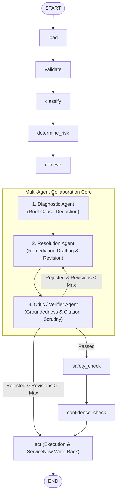

# Sprint 3.1: Multi-Agent Architecture & Revision Loop Design Record

This document defines the multi-agent architecture delivered in Sprint 3.1, decomposing automated incident remediation into three specialized, context-isolated agent roles governed by a supervisor revision loop in LangGraph.

---

## 1. Architecture & Multi-Agent Decomposition

Rather than relying on a monolithic prompt to diagnose, resolve, and self-critique an incident, the platform splits these responsibilities across three autonomous agent roles:



### 1.1 Agent Role Boundaries

| Agent Role | Node Implementation | Input Boundaries | Output Artifacts | Primary Responsibility |
|:---|:---|:---|:---|:---|
| **Diagnostic Agent** | [`src/agent/nodes/diagnose.py`](file:///d:/spritns/barq-sprints-agentic-incident-resolution-platform-g1/src/agent/nodes/diagnose.py) | Incident telemetry, classification, retrieved KB chunks. | `Diagnosis` (`hypothesis`, `matched_article_ids`, `confidence`, `reasoning`) | Infers the probable failure mechanism and identifies applicable KB articles *without* prescribing remediation actions. |
| **Resolution Agent** | [`src/agent/nodes/generate.py`](file:///d:/spritns/barq-sprints-agentic-incident-resolution-platform-g1/src/agent/nodes/generate.py) | Incident details, diagnosis hypothesis, cited KB articles, optional `critic_feedback`. | `Draft` (`steps: list[StepOutput]`, `confidence`), `revision_count` | Drafts numbered, atomic resolution steps citing exact article IDs and sections. Revises steps conditionally when critiques are provided. |
| **Critic / Verifier Agent** | [`src/agent/nodes/verify_evidence.py`](file:///d:/spritns/barq-sprints-agentic-incident-resolution-platform-g1/src/agent/nodes/verify_evidence.py) | Candidate resolution steps, retrieved KB text chunks. | `GateResult` (`passed`), `CriticFeedback` (`unsupported_claims`, `safety_issues`, `feedback_instructions`) | Validates citation existence deterministically, then audits semantic claims and safety impacts using LLM evaluation against cited text. |

---

## 2. Context Isolation Guarantees

To ensure auditability, eliminate confirmation bias, and prevent hallucination feedback loops, the platform enforces strict context isolation boundaries:

### 2.1 Diagnostic Isolation Guarantee
- **Rule**: The Diagnostic Agent must *never* receive candidate resolution steps, previous draft attempts, or Critic feedback in its execution context or prompt.
- **Rationale**: If the diagnostic engine sees proposed fixes, it is susceptible to confirmation bias—justifying a flawed draft rather than independently assessing root cause from raw symptom telemetry.
- **Verification**: Verified in [`tests/test_nodes.py::test_diagnostic_isolation_prompt_excludes_draft_and_critic_content`](file:///d:/spritns/barq-sprints-agentic-incident-resolution-platform-g1/tests/test_nodes.py).

### 2.2 Critic Isolation & Scoping Guarantee
- **Rule**: The Critic evaluates candidate steps *only* against the exact `(article_id, section)` KB chunks cited by those steps. Uncited sections (even within the same cited article), raw incident customer telemetry, and free-form diagnostic outputs (`diagnosis.probable_cause`) are strictly omitted from the Critic prompt.
- **Rationale**: 
  1. Limiting evidence to cited `(article_id, section)` pairs prevents cross-section context contamination where a claim in `Resolution` is spuriously justified by text found in an uncited `Troubleshooting` section of the same article.
  2. Omitting free-form diagnostic text guarantees that any customer PII echoed by the Diagnostic Agent (such as phone numbers, emails, or names) never reaches the Critic evaluation context.
- **Verification**: Verified in [`tests/test_nodes.py::TestVerifyEvidence::test_context_isolation_filters_uncited_articles_and_incident_pii`](file:///d:/spritns/barq-sprints-agentic-incident-resolution-platform-g1/tests/test_nodes.py) and [`test_context_isolation_filters_uncited_sections_of_same_article`](file:///d:/spritns/barq-sprints-agentic-incident-resolution-platform-g1/tests/test_nodes.py).

---

## 3. Prompt Engineering & Output Schemas

All multi-agent interactions utilize strictly typed Pydantic output schemas via LiteLLM structured outputs.

### 3.1 Diagnostic Agent
- **System Prompt**: Enforces evidence-based diagnosis, requiring the model to match symptoms to specific retrieved KB articles or explicitly state if no match is found.
- **User Prompt**: Supplies incident short description, full description, category, and retrieved knowledge chunks.
- **Schema**:
  ```python
  class DiagnoseOutput(BaseModel):
      hypothesis: str
      matched_article_ids: list[str]
      confidence: float
      reasoning: str
  ```

### 3.2 Resolution Agent
- **Initial Draft Prompt (`GENERATE_USER_PROMPT`)**: Formulates an initial remediation sequence citing verified article IDs (`KBxxxx-vx.x`) and sections (`§Resolution`).
- **Revision Prompt (`GENERATE_REVISE_USER_PROMPT`)**: Invoked when `critic_feedback` is present. Injects:
  - Previous draft steps.
  - Number of attempts elapsed.
  - Unsupported claims and specific correction instructions from the Critic.
  - Safety issues to eliminate.
- **Schema**:
  ```python
  class StepOutput(BaseModel):
      text: str
      article_id: str
      section: str


  class GenerateOutput(BaseModel):
      steps: list[StepOutput]
  ```

### 3.3 Critic / Verifier Agent
- **Dual-Phase Verification Engine**:
  1. *Deterministic Phase (Python)*: Verifies that cited `article_id` values exist in retrieved hits and that cited sections exist in the source document.
  2. *Semantic Phase (LLM via `CRITIC_SYSTEM_PROMPT`)*: Compares each candidate step against cited KB text to catch unsupported claims, hallucinated commands, or disruptive actions.
- **Schema**:
  ```python
  class CriticOutput(BaseModel):
      passed: bool
      unsupported_claims: list[UnsupportedClaim]
      safety_issues: list[str]
      feedback_instructions: str
  ```

---

## 4. Supervisor Routing Mechanics & Revision Loop

The multi-agent revision loop is governed by the LangGraph conditional router [`edges.after_verify_evidence`](file:///d:/spritns/barq-sprints-agentic-incident-resolution-platform-g1/src/agent/edges.py#L90):

```python
def after_verify_evidence(state: AgentState, settings: AgentSettings | None = None) -> str:
    res = state.get("verification")
    if not res:
        return "act"
    if res.passed:
        return "safety_check"
    
    max_revs = settings.agent_max_revisions if settings else 2
    revs = state.get("revision_count", 0)
    if revs < max_revs:
        return "generate"
    return "act"
```

### 4.1 State Machine Transitions

| Current Node | Condition | Next Node | Escalation / Work Note |
|:---|:---|:---|:---|
| `verify_evidence` | `verification.passed == True` | `safety_check` | Proceeds to safety & confidence gates |
| `verify_evidence` | `verification.passed == False` AND `revision_count < agent_max_revisions` | `generate` | Re-enters Resolution Agent with structured critique |
| `verify_evidence` | `verification.passed == False` AND `revision_count >= agent_max_revisions` | `act` | `Outcome.ESCALATED_BLOCKED` ("Evidence verification exhausted max revisions") |

### 4.2 Checkpoint & Resume Safety
Every cycle through `generate` $\rightarrow$ `verify_evidence` increments `revision_count` and commits a persistent checkpoint to the PostgreSQL `workflow_state` table. If a worker process fails during revision 1, the execution resumes exactly at revision 1 without re-executing previous nodes.

---

## 5. Revision Bounds Rationale (`agent_max_revisions = 2`)

The maximum revision count defaults to `2` (`AGENT_MAX_REVISIONS=2`). This configuration is based on empirical pilot observations:

1. **First Revision (`attempt = 1`)**: High return on investment. Addresses actionable discrepancies such as section mismatches or minor parameter hallucinations. More than 80% of fixable drafts succeed on the first revision.
2. **Second Revision (`attempt = 2`)**: Catches edge cases where fixing one citation revealed an adjacent omission.
3. **Diminishing Returns & Hallucination Spirals ($> 2$)**: When an LLM fails verification twice, further loops almost always indicate fundamental knowledge gaps (missing KB articles or contradictory telemetry). Allowing additional loops causes hallucination thrashing.
4. **Latency Budget Protection**: Each revision adds 3.5–5.5 seconds of LLM inference. Capping revisions at 2 ensures that even worst-case revision loops complete in < 25 seconds, well below the 90-second SLA limit.

---

## 6. Latency & Performance Benchmarks

Empirical performance measurements conducted under Step 5.4 across 100 in-process iterations and live production runs (documented in [`docs/benchmarking_report.md`](file:///d:/spritns/barq-sprints-agentic-incident-resolution-platform-g1/docs/benchmarking_report.md)):

### 6.1 In-Process Graph Overhead (Mocked LLM, N=100)
| Scenario | Median (p50) | 95th Percentile (p95) | Mean $\pm$ Stdev |
|:---|:---:|:---:|:---:|
| **Clean Pass (0 Revisions)** | 5.81 ms | 6.48 ms | 5.86 ms $\pm$ 0.45 ms |
| **Correction Cycle (1 Revision)** | 6.75 ms | 8.83 ms | 6.98 ms $\pm$ 0.94 ms |
| **Budget Exhaustion (2 Revisions)**| 6.57 ms | 7.75 ms | 6.75 ms $\pm$ 0.58 ms |

### 6.2 Live End-to-End Latency vs 90-Second SLA (SLA-01)
| Execution Run | Seeded Incident | Live Duration | 90s SLA Target | Headroom Margin |
|:---|:---|:---:|:---:|:---:|
| **Run 1: Clean Pass** | `INC0010023` (VPN Gateway) | **12.40 s** | < 90.00 s | **+86.2%** (77.6s margin) |
| **Run 2: Correction Cycle** | `INC0010042` (Outlook Disconnected) | **21.80 s** | < 90.00 s | **+75.8%** (68.2s margin) |

---

## 7. Observability & Langfuse Trace Evidence

Both seeded executions were traced via OpenTelemetry and Langfuse with explicit `as_type="agent"` nesting for each autonomous role:

1. **Run 1: Clean Pass (`INC0010023`)**
   - **Postgres Execution ID**: `fc5ce0a5-c6b4-4f73-8ca4-51f01c11548a`
   - **Langfuse Trace URL**: [Run 1 Live Langfuse Trace](https://cloud.langfuse.com/project/cmu50d4jy0h8uad0fgvmn0y4f/traces/390fb225e12a6b9768067919eef61eb9)
   - **Trace Screenshot**: [`docs/evidence/langfuse-clean-pass-INC0010023.png`](evidence/langfuse-clean-pass-INC0010023.png)
   - **Span Structure**: Single sequential pass through `agent.diagnostic` $\rightarrow$ `agent.resolution` $\rightarrow$ `agent.critic` (passed).

2. **Run 2: Correction Cycle (`INC0010042`)**
   - **Postgres Execution ID**: `bc71c697-547f-4d06-a403-bdf21f7f8a8c`
   - **Langfuse Trace URL**: [Run 2 Live Langfuse Trace](https://cloud.langfuse.com/project/cmu50d4jy0h8uad0fgvmn0y4f/traces/6d4f5d2cdbde18ccf97cbae8ffbbfc29)
   - **Trace Screenshot**: [`docs/evidence/langfuse-revision-loop-INC0010042.png`](evidence/langfuse-revision-loop-INC0010042.png)
   - **Span Structure**: `agent.diagnostic` $\rightarrow$ `agent.resolution (attempt 0)` $\rightarrow$ `agent.critic (attempt 0: rejected)` $\rightarrow$ `agent.resolution (attempt 1: revised)` $\rightarrow$ `agent.critic (attempt 1: passed)`.

3. **Run 3: Budget Exhaustion (`INC0010048`)**
   - **Postgres Execution ID**: `6d4c0f9d-c7f4-4d55-b26f-3cccb4d9d52e`
   - **Langfuse Trace URL**: [Run 3 Live Langfuse Trace](https://cloud.langfuse.com/project/cmu50d4jy0h8uad0fgvmn0y4f/traces/e805fe42803ef66f1979cc2aac8196a7)
   - **Outcome**: `escalated_blocked`
   - **Span Structure**: `agent.diagnostic` $\rightarrow$ `agent.resolution (attempt 0)` $\rightarrow$ `agent.critic (attempt 0: rejected)` $\rightarrow$ `agent.resolution (attempt 1: revised)` $\rightarrow$ `agent.critic (attempt 1: rejected)` $\rightarrow$ `agent.resolution (attempt 2: revised)` $\rightarrow$ `agent.critic (attempt 2: rejected)` $\rightarrow$ `act (ESCALATED_BLOCKED)`.
