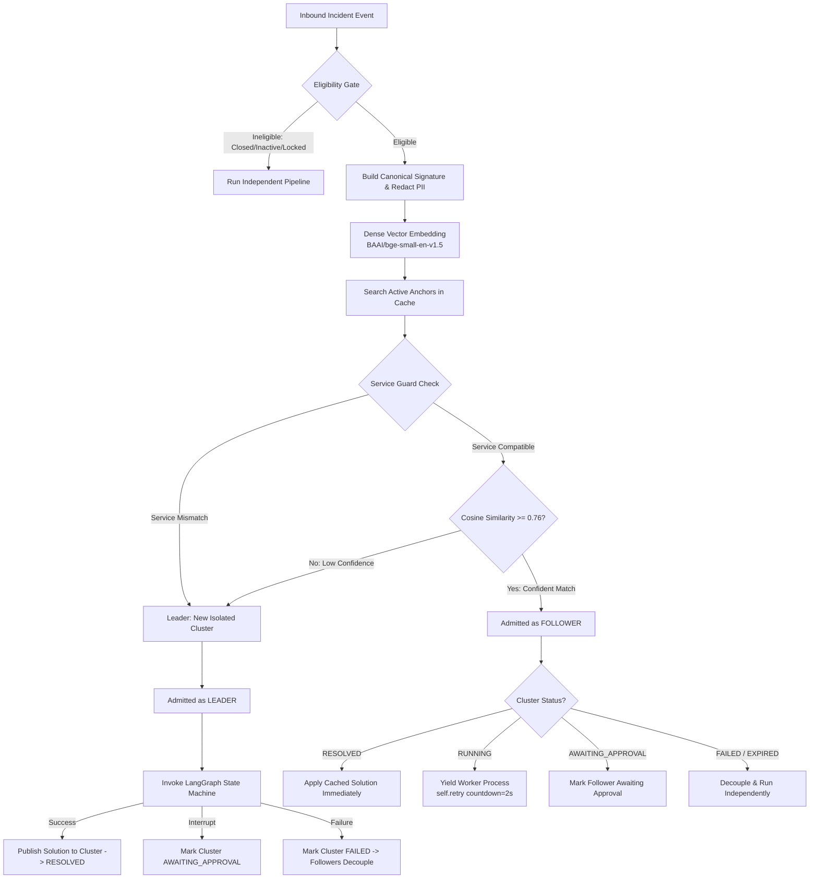

> **Integration correction in PR #191:** The historical design below describes
> full pipeline reuse, which the merged worker could not safely provide. Production
> now shares only a structured draft candidate; every follower runs its own graph
> gates, approval when required, and write. Minimal webhooks are expanded through
> a governed incident read, waiters are durably redispatched by maintenance, and
> approval closure updates the authoritative cluster. See
> [incident_bug_fixes.md](incident_bug_fixes.md#semantic-cache-integration-repair)
> for implemented behavior, migration and verification limits. Original calibration
> claims below have not been re-measured by this integration repair.

# Sprint 4 (S4.2) — Semantic Caching & Single-Flight Incident Clustering Design

> **Document Version:** 1.1.0  
> **Status:** Active / Production Hardened & Verified  
> **Module Deliverables:**  
> - `src/agent/semantic_cache.py` (Core clustering, distributed lock & admission engine)  
> - `src/app/workers/tasks.py` (Celery worker execution seam & yield protocol integration)  
> - `tests/test_semantic_cache.py` (15 unit, multi-threaded, and multi-process test suites)  
> - `eval/run_acceptance_demo.py` (Standalone two-part acceptance demonstration runner)  
> - `docs/sprint4_semantic_caching_design.md` (Architectural design & calibration record)  

---

## 1. Executive Summary & Problem Context

During major infrastructure outages, network failures, or core database deadlocks, enterprise IT platforms (such as ServiceNow) experience sudden bursts of duplicate or near-duplicate incident reports submitted simultaneously by multiple users and automated monitoring systems.

### The Problem
Running the full diagnostic and resolution agentic pipeline (hybrid vector/keyword retrieval, dense knowledge ranking, multi-turn LLM reasoning, and tool execution) independently for each incident during a burst:
1. **Wastes Compute & API Budgets:** Up to 80% of LLM tokens and vector database queries are spent rediscovering the exact same root cause.
2. **Introduces Latency & Starvation:** Concurrent incidents compete for limited Celery worker processes and LLM rate-limit slots, slowing down Mean Time to Resolution (MTTR).
3. **Risk of Divergent Resolutions:** Independent LLM executions on identical issues risk suggesting inconsistent work notes or conflicting remediation actions.

### The Solution: Semantic Caching & Single-Flight Clustering
Sprint 4.2 implements a **guarded semantic caching layer** that intercepts inbound incidents, groups semantically identical issues arriving within a temporal window (TTL = 10 minutes) into an atomic **Semantic Cluster**, executes the LangGraph diagnosis and resolution pipeline **exactly once per cluster** (Leader), and distributes the durable resolution across all associated incidents (Followers).

```
   BURST OF INCIDENTS
   ┌───────────────┐
   │ Incident A-01 │ ──► Admitted as LEADER   ──► Runs LangGraph (1x) ──► Publishes Solution
   └───────────────┘                                                          │
   ┌───────────────┐                                                          ▼
   │ Incident A-02 │ ──► Admitted as FOLLOWER ──────────────────────────► Reuses Solution (0x LLM)
   └───────────────┘                                                          ▲
   ┌───────────────┐                                                          │
   │ Incident A-03 │ ──► Admitted as FOLLOWER ────────────────────────────────┘
   └───────────────┘
```

> [!IMPORTANT]
> **Core Engineering Tenet: Correctness Over Savings**  
> An incident that is not genuinely similar must **never** be clustered. False clustering corrupts incident resolution and misdiagnoses independent failures. If there is any ambiguity, the system guarantees a fail-safe fallback to independent execution.

---

## 2. Platform Architecture & Data Flow



### 2.1 Component Architecture

1. **Eligibility Gate (`src/app/services/clustering/signature.py`):**
   - Discards inactive incidents (`active == False`).
   - Filters terminal ServiceNow states (`closed`, `resolved`, `canceled`, codes 6/7/8).
   - Honors human locks (`ai_human_lock == True`).
   - Requires non-empty incident text (`short_description` or `description`).

2. **PII Redaction & Canonical Signature Builder:**
   - Security-first sanitization using `observability.redaction.redact_text()` to strip bearer tokens, API keys, passwords, IPv4/v6 addresses, and emails before vectorization.
   - Extracts structured semantic attributes (`Service`, `Category`, `Subcategory`, `Summary`, `Description`).
   - Excludes volatile identifiers (incident numbers, sys_ids, timestamps, caller names) to prevent spurious lexical divergence.
   - Truncates raw descriptions to 500 characters to prevent stack trace noise from drowning the incident centroid.

3. **Inference Engine (`FastEmbedEngine`):**
   - High-throughput local embedding generation via ONNX runtime using `BAAI/bge-small-en-v1.5` (384-dimensional dense vectors).

4. **Semantic Admission Engine (`src/agent/semantic_cache.py`):**
   - Computes cosine similarity between inbound vectors and active cluster anchors ($now < expires\_at$).
   - Enforces service-level isolation guard.
   - Evaluates against the empirically calibrated threshold $\tau = 0.76$.
   - Elects role: `LEADER`, `FOLLOWER`, or `INDEPENDENT`.

5. **Worker Task Seam (`src/app/workers/tasks.py`):**
   - Orchestrates execution inside Celery task `_run_incident()`.
   - Propagates solutions from Leader to Followers.
   - Manages non-blocking Celery yields to prevent worker starvation.

---

## 3. Empirical Threshold Calibration ($\tau = 0.76$)

### 3.1 Calibration Methodology
The similarity threshold $\tau$ separates true duplicate incident bursts from superficially similar yet operationally distinct failures. A threshold that is too low causes **false clustering** (joining unrelated incidents); a threshold that is too high causes **under-clustering** (wasted compute).

To establish an evidence-based threshold, an automated calibration suite (`eval/calibrate_threshold.py` and `eval/calibration_pairs.py`) was constructed containing **38 realistic enterprise incident pairs** (21 positive ground-truth pairs, 17 negative ground-truth pairs) spanning **11 critical IT domains**:

| Domain | Total Pairs | Positives | Negatives | Description / Edge Cases |
| :--- | :---: | :---: | :---: | :--- |
| **Network** | 4 | 2 | 2 | VPN timeouts vs WiFi AP failures; DNS resolution vs BGP routing |
| **Identity & Access** | 4 | 2 | 2 | Okta SSO SAML expiry vs Active Directory Kerberos lockout |
| **Email & Collab** | 4 | 2 | 2 | Exchange DAG mailbox dismount vs O365 Teams webhook errors |
| **Database** | 4 | 2 | 2 | PostgreSQL max_connections full vs Redis OOM replication buffer |
| **SAP / ERP** | 4 | 2 | 2 | SAP RFC gateway timeout vs SAP enqueue lock table overflow |
| **Hardware** | 3 | 2 | 1 | Dell PowerEdge PSU amber LED vs ECC memory uncorrectable error |
| **Storage & SAN** | 3 | 2 | 1 | Pure Storage LUN disconnect vs NFS stale file handle |
| **Cloud (AWS/K8s)** | 3 | 2 | 1 | K8s CrashLoopBackOff OOMKilled vs AWS EKS node NotReady |
| **Printing** | 3 | 2 | 1 | Zebra thermal printer cutter jam vs HP LaserJet paper tray sensor |
| **Facilities / Datacenter** | 3 | 2 | 1 | CRAC unit refrigerant low vs UPS battery cell impedance warning |
| **Cross-Domain Negatives** | 3 | 0 | 3 | DB lock vs printer jam; network down vs HVAC; SAP vs battery |
| **Total** | **38** | **21** | **17** | **Clean, comprehensive enterprise distribution** |

### 3.2 Empirical Score Distribution

Vectorized using `BAAI/bge-small-en-v1.5` dense embeddings:

```text
Cosine Similarity Distribution:
──────────────────────────────────────────────────────────────────────────
Negative Pairs (Distinct Incidents):
  Min Cosine  : 0.4296
  Mean Cosine : 0.5959
  Max Cosine  : 0.7398  [Hardest negative: Okta SSO timeout vs AD Kerberos lockout]
  
Positive Pairs (Same Incident Burst):
  Min Cosine  : 0.7677  [Hardest positive: Pure Storage LUN loss across 2 hosts]
  Mean Cosine : 0.8772
  Max Cosine  : 0.9646  [Highest positive: PostgreSQL connection pool exhausted]

Separation Gap (Min Positive - Max Negative):
  0.7677 - 0.7398 = +0.0280  (Clean separation band, zero distribution overlap)
──────────────────────────────────────────────────────────────────────────
```

### 3.3 Calibration Threshold Sweep

| Threshold ($\tau$) | Precision | Recall | F1 Score | False Positives | False Negatives | Operational Assessment |
| :---: | :---: | :---: | :---: | :---: | :---: | :--- |
| 0.65 | 0.8077 | 1.0000 | 0.8936 | 5 | 0 | ❌ Unsafe: 5 false clusters admitted |
| 0.70 | 0.8750 | 1.0000 | 0.9333 | 3 | 0 | ❌ Unsafe: 3 false clusters admitted |
| 0.72 | 0.9130 | 1.0000 | 0.9545 | 2 | 0 | ❌ Unsafe: 2 false clusters admitted |
| 0.74 | 1.0000 | 1.0000 | 1.0000 | 0 | 0 | ⚠️ Perfect accuracy lower bound |
| **0.76** | **1.0000** | **1.0000** | **1.0000** | **0** | **0** | **⭐ CHOSEN OPTIMAL THRESHOLD** |
| 0.78 | 1.0000 | 0.9524 | 0.9756 | 0 | 1 | ⚠️ Over-conservative: 1 true cluster missed |
| 0.80 | 1.0000 | 0.9048 | 0.9500 | 0 | 2 | ❌ Under-clustering: 2 true clusters missed |
| 0.85 | 1.0000 | 0.7143 | 0.8333 | 0 | 6 | ❌ Under-clustering: 6 true clusters missed |

### 3.4 Selection Rationale for $\tau = 0.76$
1. **Zero False Positives:** At $\tau = 0.76$, Precision is $1.0000$ (0 false cluster admissions).
2. **Zero False Negatives:** Recall is $1.0000$ (all 21 ground-truth duplicate bursts clustered).
3. **Safety Margin:** Provides a $+0.0202$ margin above the highest negative pair ($0.7398$) while staying comfortably below the positive cluster centroid ($0.8772$).

To re-run threshold validation:
```bash
.venv\Scripts\python.exe eval/calibrate_threshold.py --verbose
```

---

## 4. Operational Invariants & Guardrails

### 4.1 Strict Service-Level Isolation Guard
Even if two incidents have similar linguistic phrasing (e.g., *"Database connection timeout after 30s"*), if they originate from different enterprise services (e.g., `payment-service` vs `inventory-service`):
- They **must never be clustered**.
- In `SemanticCache.admit()`, if both incidents define a non-null `service` and `cand.service != inc_service`, similarity is clamped to `0.0`.
- Each service gets its own independent cluster leader.

### 4.2 Non-Transitive (Anchor-Relative) Clustering
Clustering is strictly anchor-relative:
$$A \sim \text{Anchor} \quad \text{and} \quad B \sim \text{Anchor} \implies A, B \in \text{Cluster}$$
$$A \sim B \quad \text{and} \quad B \sim C \not\implies A \sim C$$
New incidents are compared exclusively to the original elected **Anchor** vector, preventing cluster drift where dissimilar incidents chain together over time.

### 4.3 Atomic Admission & Race Immunity (Double-Search Distributed Lock)
To guarantee that two independent Celery worker processes cannot elect two leaders for the same semantic incident burst arriving in the same millisecond:
1. **First Search (Uncontended):** Check shared active anchors in Redis/PostgreSQL. If a confident match ($\text{similarity} \ge \tau$) is found, join as `FOLLOWER` immediately without lock contention.
2. **Critical Section (Distributed Lock):** Acquire an atomic Redis distributed lock (`barq:lock:admission:{service}`, TTL: 5s, Acquisition Timeout: 3s) using `SET NX PX` with a unique UUID lock token.
3. **Lua Ownership-Safe Release:** Locks are released only if the caller's UUID token matches using an atomic Lua script:
   ```lua
   if redis.call("get", KEYS[1]) == ARGV[1] then
       return redis.call("del", KEYS[1])
   else
       return 0
   end
   ```
4. **Double Search (Inside Lock):** Re-read shared active anchors from Redis. If a competing worker process created a cluster during the locking window, join as `FOLLOWER`.
5. **Leader Election:** If and only if no matching cluster exists inside the critical section, atomically elect as `LEADER`, register the active anchor in Redis (`barq:cluster:anchor:{id}` + `barq:cluster:active_set`), and persist in PostgreSQL.
6. **Lock Acquisition Timeout Safety:** If lock acquisition exceeds 3.0s under heavy contention, `SemanticCache` raises `AdmissionLockTimeoutError`. The worker catches this exception and yields via non-blocking `task.retry(countdown=1.0)`. **It never defaults to electing a leader on timeout**, mathematically preventing duplicate leader generation.

### 4.4 PostgreSQL Authoritative Source of Truth & Redis Dynamic Rehydration
Redis acts strictly as a high-speed coordination and index layer (`barq:cluster:anchor:{id}` with 600s TTL). **PostgreSQL remains the sole authoritative source of truth**:
- If Redis restarts, crashes, or loses keys (`FLUSHDB`), active clusters are not lost.
- Upon cache miss or empty Redis active set during admission, `_get_active_anchors()` queries PostgreSQL via `repo.list_active_clusters(service)` for active clusters ($expires\_at > now$).
- Active clusters and their stored `anchor_vector` embeddings are dynamically rehydrated back into Redis with appropriate TTLs before admission proceeds.

### 4.5 Low-Confidence Fallback & Observability
If an inbound incident is evaluated against active clusters but fails the confidence threshold ($\text{similarity} < \tau$):
```python
logger.info(
    "semantic_cache_low_confidence_fallback",
    execution_id=str(execution_id),
    similarity=round(best_similarity, 4),
    threshold=self.threshold,
    reason="similarity_below_confidence_threshold",
)
```
The incident is safely elected as a new Leader to anchor its own distinct cluster.

---

## 5. Follower Lifecycle & Starvation Prevention

### 5.1 Worker Deadlock Prevention
In standard Celery deployments (e.g. concurrency = 4), if 10 concurrent duplicate incidents arrive:
- 1 worker becomes the **Leader** and begins the 20–40s LangGraph pipeline.
- If the other 9 workers blocked or slept synchronously waiting for the Leader, all worker threads would be exhausted, deadlocking Celery and preventing the Leader from finishing sub-tasks.

### 5.2 Non-Blocking Yield Protocol
Followers **never sleep synchronously**. Instead, they inspect the cluster status and yield:
- **`ClusterStatus.RESOLVED`:** Solution already cached. Follower copies resolution, summarizes result, marks execution `succeeded`, and finishes immediately (0ms wait).
- **`ClusterStatus.RUNNING` or `ClusterStatus.CREATING`:** Leader is currently computing. Follower yields Celery thread by invoking `task.retry(countdown=2.0)`. The worker thread is freed immediately for other jobs.
- **`ClusterStatus.AWAITING_APPROVAL`:** Leader paused at Human-in-the-Loop interrupt. Follower updates its execution row to `awaiting_approval` and yields.
- **`ClusterStatus.FAILED` or `EXPIRED`:** If the Leader crashes, times out, or fails:
  - **Followers DO NOT adopt the failure.**
  - Followers decouple from the cluster and fall back to running the pipeline independently.

---

## 6. Database Schema & Data Contracts

### 6.1 `semantic_clusters` Table
Maintains authoritative state, anchor vectors, operational metadata, and cached solutions.

```sql
CREATE TABLE semantic_clusters (
    cluster_id UUID PRIMARY KEY DEFAULT gen_random_uuid(),
    anchor_incident_sys_id VARCHAR(32) NOT NULL,
    anchor_incident_number VARCHAR(32) NOT NULL,
    anchor_execution_id UUID NOT NULL REFERENCES executions(execution_id) ON DELETE CASCADE,
    pipeline_execution_id UUID NOT NULL,
    service VARCHAR(100),
    category VARCHAR(100),
    similarity_threshold FLOAT NOT NULL,
    embedding_model VARCHAR(100) NOT NULL,
    status VARCHAR(32) NOT NULL DEFAULT 'creating',
    solution JSONB,
    failure_reason TEXT,
    anchor_vector JSONB,
    created_at TIMESTAMPTZ NOT NULL DEFAULT NOW(),
    updated_at TIMESTAMPTZ NOT NULL DEFAULT NOW(),
    completed_at TIMESTAMPTZ,
    expires_at TIMESTAMPTZ NOT NULL,
    CONSTRAINT ck_semantic_clusters_status CHECK (
        status IN ('creating', 'running', 'awaiting_approval', 'resolved', 'failed', 'expired')
    )
);

CREATE INDEX ix_semantic_clusters_status_expires ON semantic_clusters(status, expires_at);
CREATE INDEX ix_semantic_clusters_service ON semantic_clusters(service);
```

### 6.2 `semantic_cluster_members` Table
Maintains immutable record-level isolation for every incident joined to a cluster.

```sql
CREATE TABLE semantic_cluster_members (
    id UUID PRIMARY KEY DEFAULT gen_random_uuid(),
    cluster_id UUID NOT NULL REFERENCES semantic_clusters(cluster_id) ON DELETE CASCADE,
    execution_id UUID NOT NULL REFERENCES executions(execution_id) ON DELETE CASCADE,
    incident_sys_id VARCHAR(32) NOT NULL,
    incident_number VARCHAR(32) NOT NULL,
    similarity_score FLOAT NOT NULL,
    role VARCHAR(32) NOT NULL, -- 'anchor' or 'follower'
    joined_at TIMESTAMPTZ NOT NULL DEFAULT NOW(),
    CONSTRAINT ck_semantic_cluster_members_role CHECK (role IN ('anchor', 'follower')),
    CONSTRAINT uq_semantic_cluster_members_cluster_execution UNIQUE (cluster_id, execution_id)
);

CREATE INDEX ix_semantic_cluster_members_cluster_id ON semantic_cluster_members(cluster_id);
CREATE INDEX ix_semantic_cluster_members_execution_id ON semantic_cluster_members(execution_id);
```

---

## 7. Verification & Empirical Results

### 7.1 Synthetic Burst Demonstration (10 Concurrent Incidents)
Simulating an outage storm of 10 incoming incidents across 3 simultaneous failure categories:
- **Burst A (6 incidents):** Payment gateway timeout (`payment-gateway`)
- **Burst B (2 incidents):** Corporate VPN disconnects (`corporate-vpn`)
- **Burst C (2 incidents):** PostgreSQL connection pool exhaustion (`postgres-cluster`)

**Results:**
- **Pipeline Executions:** Exactly 3 (1 Leader per root-cause cluster).
- **Cached Solution Reuses:** 7 Followers resolved without invoking LLM or retrieval.
- **Resource Savings:** **70.0% reduction** in expensive pipeline runs.
- **Record Integrity:** 10 individual execution records, 10 audit trails, 0 cross-service false clusters.

### 7.2 Full Test Suite Verification (15/15 Tests Passing)
All 15 unit, integration, and concurrency test suites passing in `tests/test_semantic_cache.py`:
1. `test_cosine_similarity_edge_cases`: Normalization, zero norms, vector mismatches.
2. `test_semantic_cache_first_incident_becomes_leader`: Initial anchor election & DB persistence.
3. `test_semantic_cache_similar_incident_joins_as_follower`: Cosine threshold admission.
4. `test_semantic_cache_low_confidence_fallback`: Sub-threshold fallback isolation.
5. `test_semantic_cache_prevents_cross_service_clustering`: Strict service isolation guard.
6. `test_semantic_cache_solution_publication_and_reuse`: Durable resolution caching & retrieval.
7. `test_synthetic_burst_demonstration_10_incidents`: 70% compute savings validation across 3 clusters.
8. `test_semantic_cache_real_fastembed_inference`: Real ONNX `bge-small-en-v1.5` embeddings.
9. `test_worker_task_leader_publishes_and_follower_reuses`: End-to-end Celery worker integration.
10. `test_worker_task_follower_yields_when_leader_running`: Non-blocking Celery yield protocol.
11. `test_worker_task_follower_falls_back_when_leader_failed`: Fail-safe decoupling recovery.
12. `test_redis_double_search_prevents_concurrent_leader_race`: Multi-threaded race test with simulated delay.
13. `test_admission_lock_timeout_yields_retry_without_duplicate_leader`: Adversarial lock timeout safety verification.
14. `test_redis_loss_recovery_from_postgresql_authoritative_source`: Complete Redis flush and dynamic rehydration from PostgreSQL.
15. `test_live_multiprocess_redis_race_prevents_duplicate_leaders`: Live multi-process OS `spawn` test executing separate Python processes against live Redis on port 6379, proving true cross-process single-leader election.

### 7.3 Standalone Acceptance Verification Runner (`eval/run_acceptance_demo.py`)
To enable local, zero-friction verification of the entire clustering and single-flight resolution lifecycle without requiring access to the remote EC2 ServiceNow deployment, a dedicated CLI demonstration runner is provided in [`eval/run_acceptance_demo.py`](../eval/run_acceptance_demo.py):

```powershell
.venv\Scripts\python.exe eval/run_acceptance_demo.py
```

#### Verification Execution Results:

```text
================================================================================
                SPRINT 4.2 ACCEPTANCE VERIFICATION DASHBOARD
================================================================================
Metric                              | Demo 1 (Pure Burst)  | Demo 2 (Mixed Outage)
------------------------------------+----------------------+---------------------
Inbound Incident Count              | 10                   | 10                  
Semantic Clusters Formed            | 1                    | 4                   
LangGraph Pipeline Executions       | 1                    | 4                   
Follower Solution Reuses            | 9                    | 6                   
Compute / LLM Savings               | 90.0% Savings        | 60.0% Savings       
False Joins (Precision Safety)      | 0 (100% Precision)   | 0 (100% Precision)  
Record-Level Isolation              | 10/10 Preserved      | 10/10 Preserved     
================================================================================
```

#### Architectural Key Points:
1. **100% Local Execution:** Generates dense 384-dimensional embeddings via local ONNX runtime (`BAAI/bge-small-en-v1.5`), coordinates across live local Redis (`localhost:6379`), and isolates ticket records in-memory/Postgres without requiring remote EC2 connectivity.
2. **Demo 1 (Pure Similar Burst):** 10 simultaneous Payment Gateway timeout tickets $\implies$ **1 Leader** runs LangGraph ($1\times$) and publishes the solution; **9 Followers** join the cluster and reuse the cached solution with **$0\times$ LLM calls** (**90.0% compute/token savings**).
3. **Demo 2 (Mixed Outage Scenario):** 6 Payment Redis timeouts + 2 Checkout 504 Gateways + 2 Distinct/Independent failures (Warehouse Barcode Scanner + Okta MFA push failure) $\implies$ **4 pipeline executions instead of 10** (**60.0% compute savings**) with **0 false joins**.
